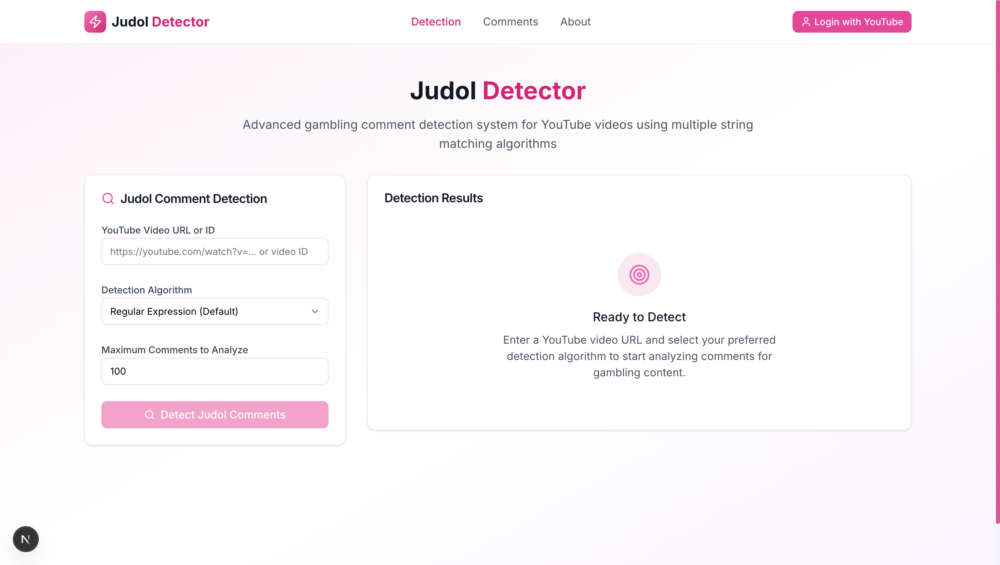

<div align="center"> <h1>Judol Detector</h1> <h3>Detect Online Gambling Comments on YouTube</h3> <p><em>This project was developed for <strong>Task Seleksi IRK</strong></em></p> <p>      </p> </div>



## Description
Judol Detector is a web-based application designed to detect online gambling comments on YouTube videos using advanced string matching algorithms and Unicode normalization. The application leverages YouTube API to fetch comments and analyzes them using various algorithms including Regex, KMP, Boyer-Moore, and Rabin-Karp to identify gambling-related content that often evades detection through Unicode manipulation.

## Key Features

### Core Features

  * **YouTube Integration**: Accepts YouTube video links or video IDs for comment analysis.
  * **Multiple String Matching Algorithms**: Choose from Regex, KMP, Boyer-Moore, and Rabin-Karp algorithms.
  * **Custom Pattern Files**: Upload `.txt` files for custom string matching patterns (non-regex algorithms).
  * **Unicode Normalization**: Advanced normalization for 9 different Unicode font types to detect disguised gambling terms.
  * **Clean Interface**: User-friendly web interface for easy navigation and analysis.

### Advanced Features

  * **Comment Management**: Insert and delete comments on your own YouTube channel.
  * **Batch Operations**: Add multiple comments from text files (semicolon-separated).
  * **Smart Deletion**: Automatically delete only gambling-related comments from your channel.
  * **Extended Font Support**: Normalization for 9 Unicode font types including bonus mathematical fonts.
  * **Full Deployment**: Both frontend and backend deployed and accessible online.

### Supported Unicode Font Normalization

  * **Mathematical Italic** (`0x1D434-0x1D467`)
  * **Mathematical Sans-Serif Bold** (`0x1D5D4-0x1D607, 0x1D7EC-0x1D7F5`)
  * **Mathematical Sans-Serif Bold Italic** (`0x1D608-0x1D63B`)
  * **Fullwidth** (`0xFF21-0xFF5A, 0xFF10-0xFF19`)
  * **Monospace** (`0x1D670-0x1D6A3, 0x1D7F6-0x1D7FF`)
  * **Mathematical Script Bold Italic** (`0x1D4D0-0x1D503`) - Bonus
  * **Mathematical Double-Struck** (`0x1D538-0x1D56B, 0x1D7D8-0x1D7E1`) - Bonus
  * **Mathematical Fraktur Bold** (`0x1D56C-0x1D59F`) - Bonus
  * **Enclosed Alphanumerics** (`0x24EA, 0x2460-0x2473, 0x24D0-0x24E9, 0x24B6-0x24CF, 0x1F170-0x1F189`) - Bonus

## Deployment
- Frontend: https://judol-detector-gg.vercel.app/
- Backend: https://judol-detector-production.up.railway.app

## How to Setup Locally

Follow these steps to set up and run the **Judol Detector** project on your local machine.

1.  **Clone the Repository**
    ```bash
    git clone https://github.com/carloangkisann/judol-detector.git
    ```
2.  **Navigate to the Project Directory**
    ```bash
    cd judol-detector
    ```

#### Frontend Setup

1.  **Navigate to the Frontend Directory**
    ```bash
    cd frontend
    ```
2.  **Install Dependencies**
    ```bash
    npm install
    ```
3.  **Create Environment File**
    Create a `.env` file in the `frontend` directory and add the following content:
    ```
    NEXT_PUBLIC_API_BASE_URL=https://judol-detector-production.up.railway.app
    NEXT_PUBLIC_SITE_URL=http://localhost:3000
    ```
4.  **Run the Frontend Application**
    ```bash
    npm run dev
    ```
    The frontend will be available at `http://localhost:3000`.

#### Backend Setup

1.  **Navigate to the Backend Directory**
    ```bash
    cd backend
    ```
2.  **Set up a Python Virtual Environment**
    It's recommended to use a virtual environment to manage dependencies.
    ```bash
    # Create the virtual environment
    python -m venv venv

    # Activate the virtual environment
    # On macOS/Linux:
    source venv/bin/activate
    # On Windows:
    .\venv\Scripts\activate
    ```
3.  **Install Dependencies**
    ```bash
    pip install -r requirements.txt
    ```
4.  **Create Environment File**
    Create a `.env` file in the `backend` directory and add your credentials. You will need to obtain your own **YouTube API Key** and **Google OAuth Credentials** for the application to work correctly.
    ```
    # YouTube API Key
    YOUTUBE_API_KEY=YOUR_YOUTUBE_API_KEY_HERE

    # Google OAuth Credentials
    GOOGLE_CLIENT_ID=YOUR_GOOGLE_CLIENT_ID_HERE
    GOOGLE_CLIENT_SECRET=YOUR_GOOGLE_CLIENT_SECRET_HERE
    GOOGLE_PROJECT_ID=YOUR_GOOGLE_PROJECT_ID_HERE

    # Application Settings
    REDIRECT_URI=https://judol-detector-production.up.railway.app/api/auth/callback
    ```
5.  **Run the Backend Application**
    ```bash
    uvicorn app.main:app --reload --port 8000
    ```
    The backend API will be available at `http://localhost:8000`.

## Author
<table>
  <tr>
    <td align="center">
      <a href="https://github.com/carllix">
        <br />
        <span><b>Carlo Angkisan</b></span>
      </a>
    </td>
  </tr>
</table>
